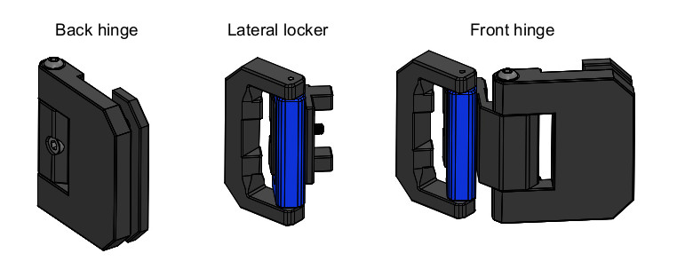

/!\ Read this before starting /!\  
The version for 3mm thick panels was not tested, feel free to contact me if you have any doubt or recommendation.  
It allow to open the front door at 155° MAX and the access to the locker bracket is very limited.  

# DESCRIPTION
  
Lateral body locker and back hinge parts need support to be printed.

# BOM
8x SHCS M3x40 For V1 or 8x BHCS M3x45 for V2  
8x SHCS M3x12  
8x SHCS M3x10  
16x SHCS M3x8  
8x T-slot nut M3  
4x Sliding T-nut M3  
16x Ø1.4x10 metallic pin or cut nails  
16x Ø1.4x20 metallic pin or cut nails  

# ASSEMBLY

