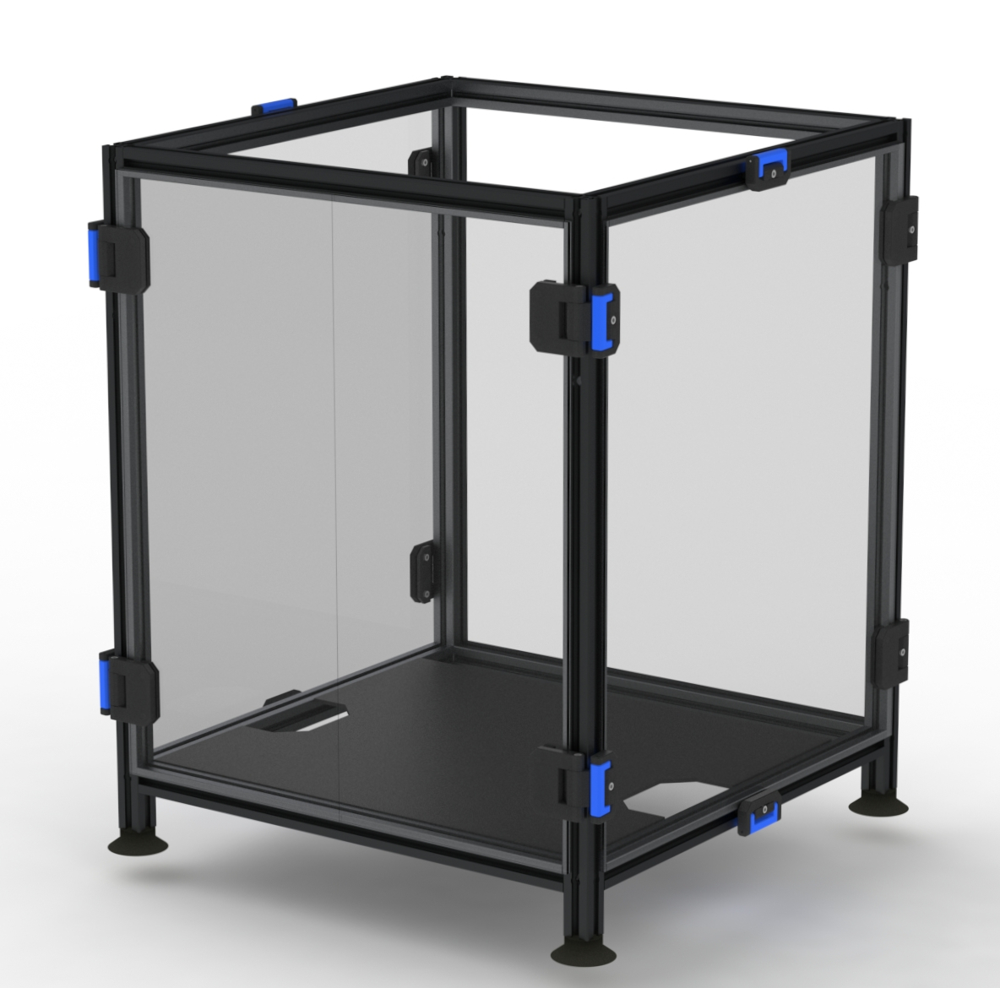
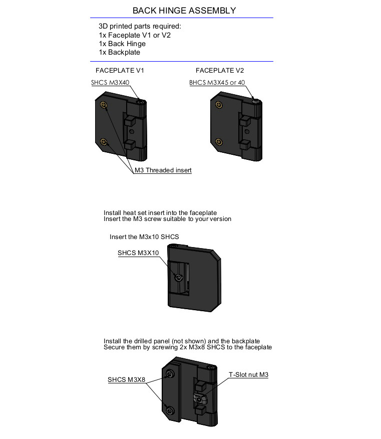
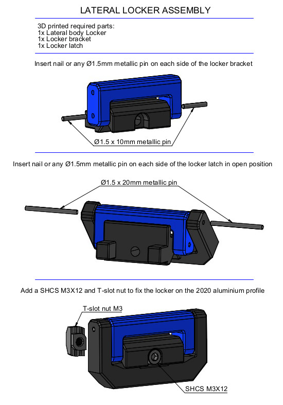
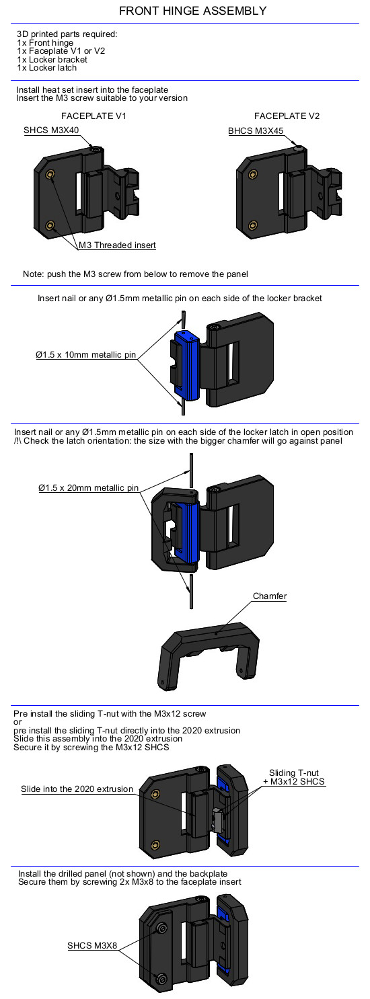

# Removable Lateral panels and front doors + lockers 
# OVERVIEW
This mod allow to get removable lateral and front panels. Side panels are maintained with lockers.  
/!\ Read this before starting /!\  
This version for 3mm thick panels was not tested, feel free to contact me if you have any doubt or recomendation.  
This version allow to open the front door at 155° MAX and the access to the locker bracket is very limited.  

# BOM
8x SHCS M3x40 For V1 or 8x BHCS M3x45 for V2  
8x SHCS M3x12  
8x SHCS M3x10  
16x SHCS M3x8  

# INSTRUCTIONS

