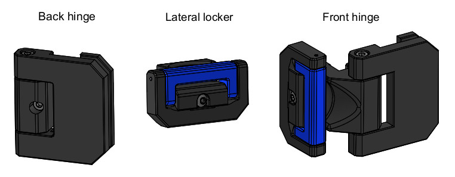
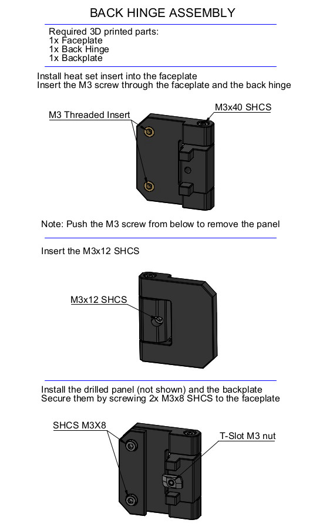
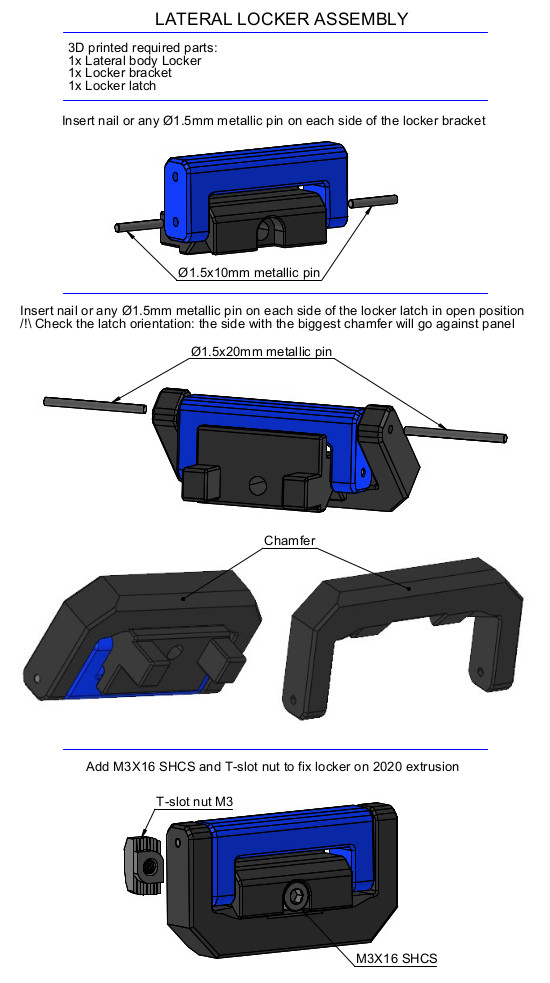
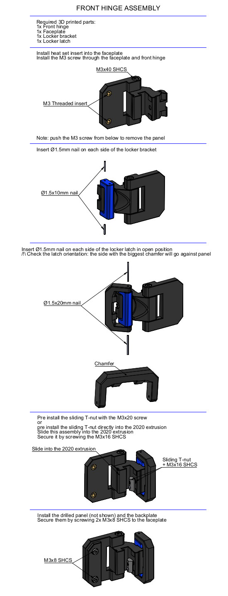

This version is used for 3mm thick panels + 3mm foam for side panels and front doors.  
It allow to open the front door at 165° MAX and the access to the locker bracket is a bit limited.

# DESCRIPTION
  
Lateral body locker and back hinge parts need support to be printed.

# BOM
8x SHCS M3x40  
8x SHCS M3x16  
4x SHCS M3x12  
16x SHCS M3x8  
8x T-slot nut M3  
4x Sliding T-nut M3  
16x Ø1.4x10 metallic pin or cut nails  
16x Ø1.4x20 metallic pin or cut nails  

# ASSEMBLY

