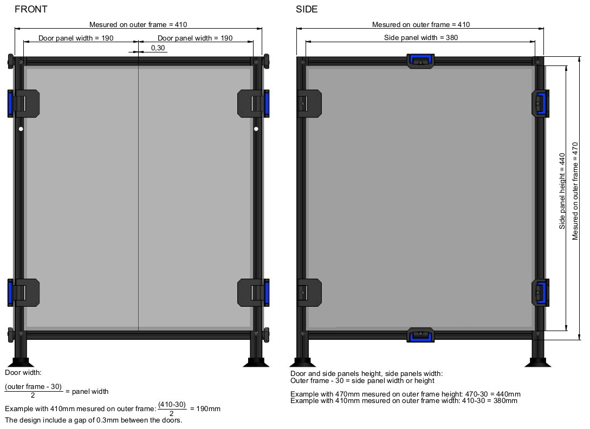

# Removable Lateral panels and front doors + lockers.
# OVERVIEW
This mod allow to get removable lateral panels and front panels. Side panels are maintained with lockers. Also, side panels and front doors are mounted on hinges and can simply be opened if it is not necessary to remove them.

/!\ Read this before starting /!\  
This version is used for 3mm thick panels + 3mm foam for side panels and front doors.  
It allow to open the front door at 165° MAX and the access to the locker bracket is a bit limited.

# DESCRIPTION
  
  
Lateral body locker and back hinge parts need support to be printed.

# BOM
8x SHCS M3x40  
8x SHCS M3x16  
4x SHCS M3x12  
16x SHCS M3x8  
8x T-slot nut M3  
4x Sliding T-nut M3  
16x Ø1.4x10 metallic pin or cut nails  
16x Ø1.4x20 metallic pin or cut nails  

# PANELS DIMENSIONS

Side panels and doors use the same cutout. units:mm  

