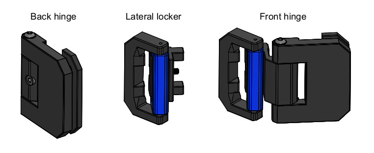
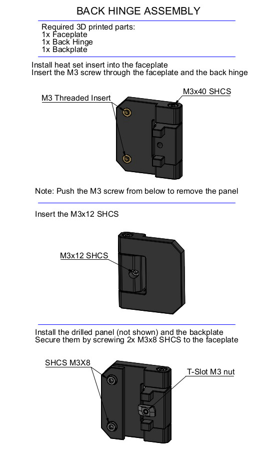
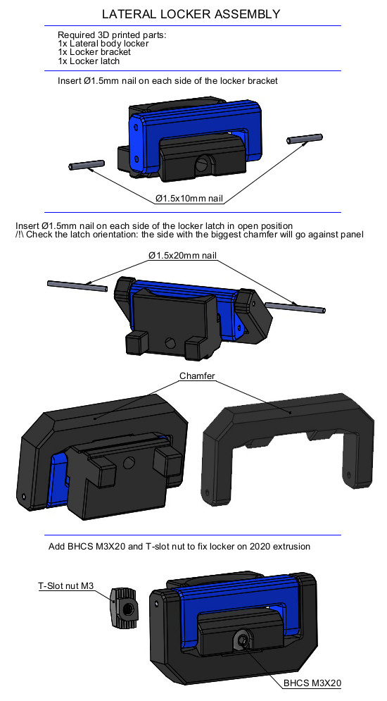
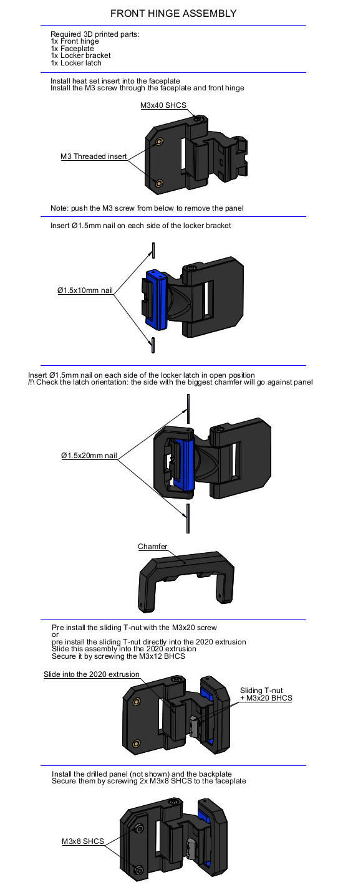

This version is used for 3mm thick panels + 6mm foam.  
It allow to open the front door at 180°.

# DESCRIPTION
  
Lateral body locker and back hinge parts need support to be printed.

# BOM
8x SHCS M3x40  
8x BHCS M3x20  
4x SHCS M3x12  
16x SHCS M3x8  
8x T-slot nut M3  
4x Sliding T-nut M3  
16x Ø1.4x10 metallic pin or cut nails  
16x Ø1.4x20 metallic pin or cut nails  
4x Ø6x3mm neodymium magnet  

# ASSEMBLY

