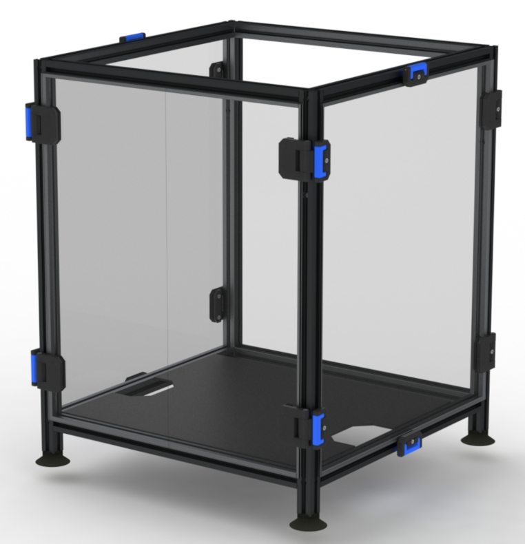
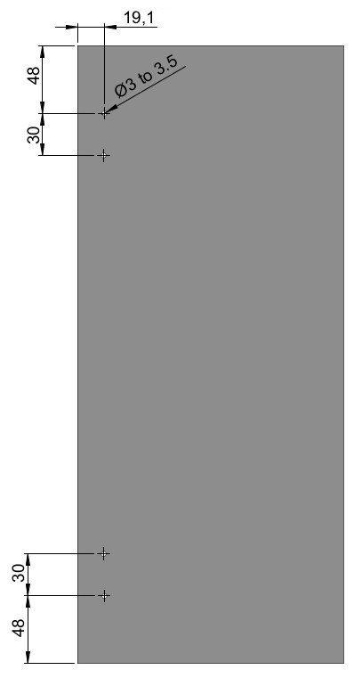

3mm version use 3mm acrilic panels flush to 2020 extrusion frame.  

6mm version use 3mm acrilic panels + 3mm foam.

9mm version use 3mm acrilic panels + 6mm foam.

Please contact me if you need a custom thickness version.  

# Removable Lateral panels and front doors + lockers.
# OVERVIEW
This mod allow to get removable lateral panels and front doors. Side panels are maintained with lockers while front doors are maintained with magnets. Also, side panels and front doors are mounted on hinges and can simply be opened if it is not necessary to remove them.

Closed doors and panels  
  
Open doors and panels  
  
Doors and panels removed  
  
  
  

# PANELS DIMENSIONS

Side panels and doors use the same cutout. units:mm  

