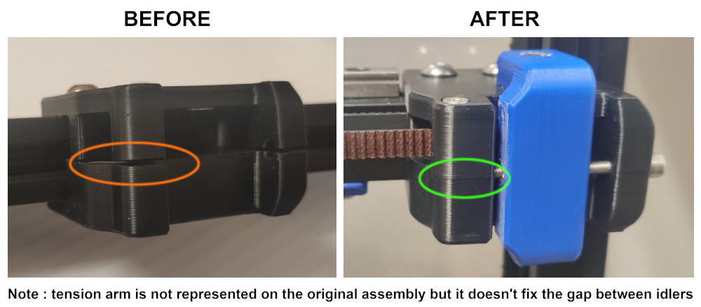
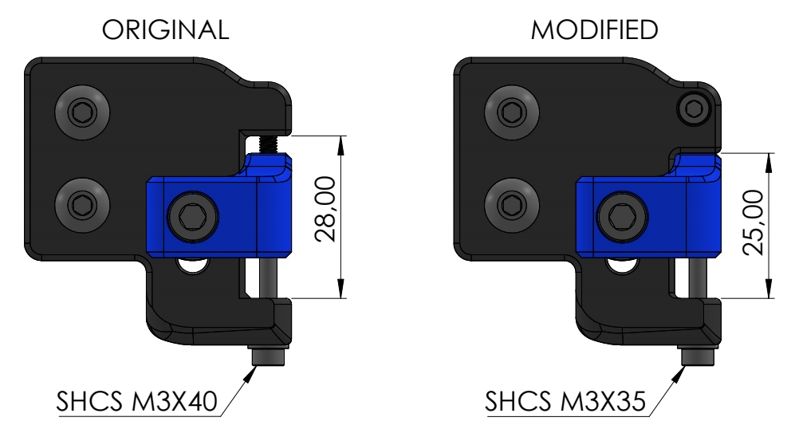
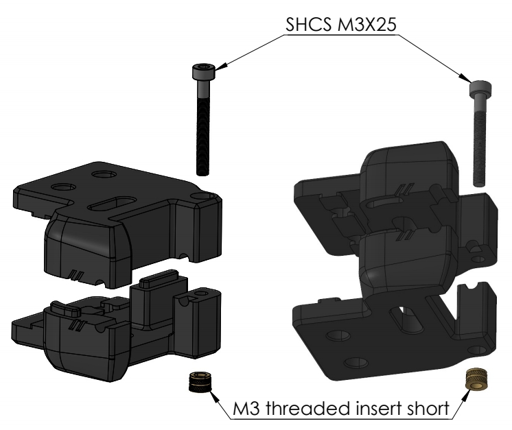

# Front idler AB
# OVERVIEW
A small change of the front idlers to remove the gap that may appear.

# BOM
2x SHCS M3X35  
2x M3 Threaded insert short (those are the same used in your stock Voron BOM)

# DESCRIPTION
The tension stroke is slightly reduced from 28mm to 25mm. This allow to get enough wall thickness for the screw and insert.
/!\ Warning /!\ : If your belts were flush mounted to your X carriage, then you will have to replace them for longer ones.

# INSTRUCTIONS
1. Install heat set insert into the bottom A and B idler. Use and iron solder for this step.
2. Screw the M3x25 SHCS on top of A and B idler.
3. That is it! All that remain is in the stock assembly manual.

