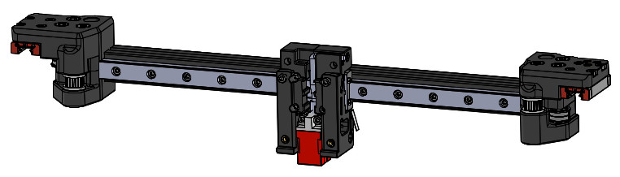
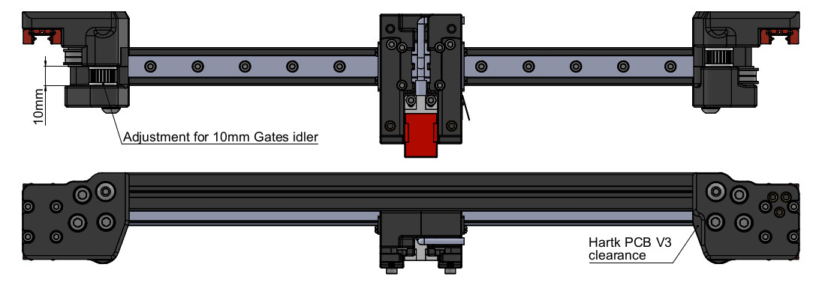
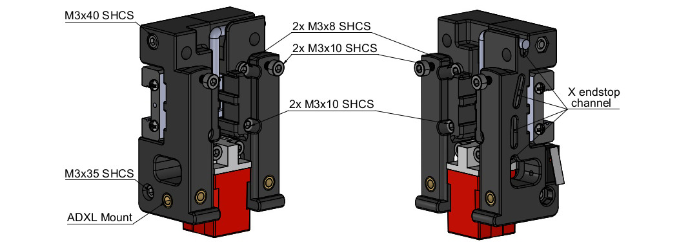

# X axis MGN12 + Gates idlers + Hartk PCB + ADXL mount
# OVERVIEW
This mod allow to replace the originals 2x MGN9 rails by a single MGN12 on X axis.  
XY joints were modified to match Gates idler height (10mm) and add a clearance on the right XY joint so there is no conflict with the Hartk PCB toolhead.  
Finally, there is a dedicated channel for X endstop wires, the possiblity to use the PL-08N probe and an ADXL mount.
Carriage modifications are only compatible with ClockWork 1 extruder. Installation of StealthBurner body and Toolhead is perfectly OK.

XY joints modificacions

X carriage

