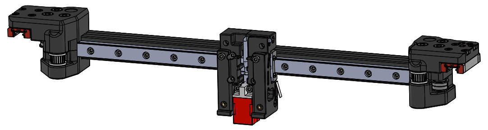

# X axis MGN12 + Gates idlers + Hartk PCB + Clokwork 1 + ADXL mount
# OVERVIEW
This mod allow to replace the originals 2x MGN9 rails by a single MGN12 on X axis.  
XY joints were modified to match Gates idler height (10mm) and add a clearance on the right XY joint so there is no conflict with the Hartk PCB toolhead.  
Finally, there is a dedicated channel for X endstop wires, the possiblity to use the PL-08N probe and an ADXL mount even though Stealthburner Toolhead already have in-built ADXL mount.  
X Carriage is only compatible with ClockWork 1 extruder and Stealthburner toolhead.

XY joints modifications

X carriage

# BOM
2x Gates idler, toothed is preferable  
1x M3x40 SHCS  
1x M3x35 SHCS  
4x M3x10 SHCS  
2x M3x8 SHCS  
1x MGN12 x 300 or 350mm (length match your own config) with MGN12H carriage  
